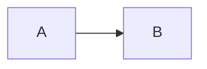
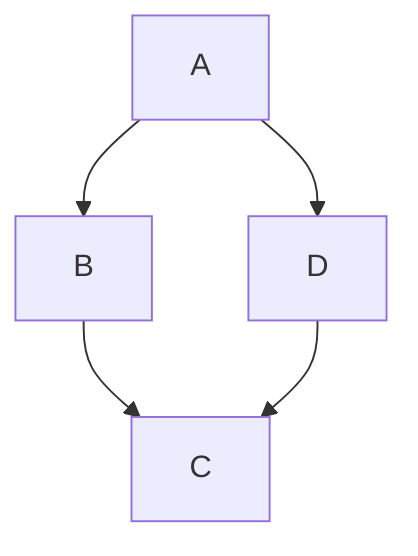
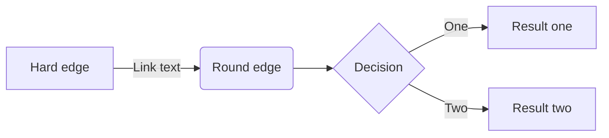

# second-test

[gfm](https://github.github.com/gfm/)

# Markdown

## Table (GFM)

| name  | age | gender    | money  |
|-------|:---:|-----------|-------:|
| rhio  | 384 | robot     | $3,000 |
| haroo | .3  | bird      | $430   |
| jedi  | ?   | undefined | $0     |

## Multimarkdown

A^superscript^

A~subscript~

++underline++

## Math Expression

Inline Math expression

$x^2$ or $$x^2$$

Block Math expression

$
x^2
$

## Media Embed

@[Alt Text](Content-URL "CSS")

@[Haroopad](https://vimeo.com/70385914 "width:100%;height:350px")

## Diagram (with v0.13)

    
## Tasklist (with v0.13)

- [ ] first task
- [x] second task is done
- [ ] third task

## Presentation (with v0.13)

## slide1 title

slide2 content

***

## slide2 title

slide2 content

## Footnotes (with v0.12)

This is footnote[^1]

[^1]: explanatory information
